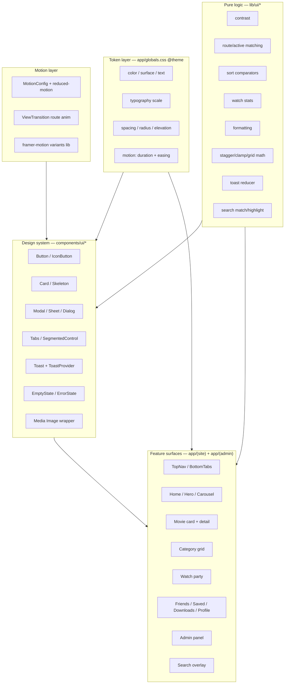

# Design Document

## Overview

This design describes a comprehensive UI/UX overhaul of MovieZone, a private streaming platform built on Next.js 16 (App Router, React 19) with a Supabase (Postgres) backend and Google Drive media storage. The goal is to raise the entire surface — public site, watch party, friends, admin panel, and all supporting views — to the visual and interaction quality of leading streaming apps, while staying faithful to the existing architecture.

The overhaul is deliberately **additive and refactor-first** rather than a rewrite:

- The app already has a solid, centralized token layer (Tailwind v4 `@theme` in `app/globals.css`), a dark surface ramp, a red brand accent, `Inter`, 2:3 poster cards, snap carousels, and shimmer skeletons. We **extend** these tokens to satisfy Requirement 1 rather than replacing them.
- `framer-motion@12` is already a dependency but essentially unused. It becomes the motion engine for component-level animation (Requirement 14).
- The `components/ui/`, `components/carousel/`, `components/hero/`, and `components/layout/` directories exist but are **empty**. This is the biggest gap and the biggest opportunity: the overhaul introduces a real design-system primitive library there (Button, Card, Modal, Sheet, Tabs, Toast, Skeleton, EmptyState, etc.) that every page consumes.
- Data access stays where it is (server components reading through `lib/supabase/admin.ts` and the RLS-bound `lib/supabase/server.ts`; client data through React Query hooks calling `/api/*`). The overhaul changes presentation, not the data contract.

### Design principles

1. **Tokens are the single source of truth.** Every color, space, radius, shadow, and motion value referenced by a component resolves to a token declared in `app/globals.css`. No hard-coded hex or ad-hoc durations in components.
2. **Server renders content, client owns motion.** Pages remain Server Components that fetch data; interactive, animated chrome is isolated into `"use client"` primitives. This preserves streaming/prefetching and keeps client bundles small.
3. **Pure logic is extracted and tested.** Presentational math — contrast ratios, active-tab matching, sort comparators, watch statistics, formatting, stagger/clamp math, toast stacking — lives in framework-free modules under `lib/ui/` so it can be unit- and property-tested independent of React.
4. **Motion is a preference, not a default.** `prefers-reduced-motion` is honored globally through a single `useReducedMotion`-aware wrapper and CSS guards; reduced motion collapses durations to 0ms while preserving visibility/layout.

### Next.js 16 constraints that shape this design

This project runs a modified Next.js 16. The relevant, verified breaking changes from `node_modules/next/dist/docs` that this design must respect:

- **`next/image` `priority` is deprecated** (Next 16) in favor of `preload`. LCP images (hero, detail backdrop) use `preload` + `fetchPriority="high"`, not `priority`.
- **`images.qualities` is now required** in `next.config.ts` if any `<Image quality>` differs from the default `75`. Requests for non-allowlisted qualities return `400`.
- **Remote images require `images.remotePatterns`.** MovieZone posters/backdrops are remote (Drive/CDN URLs), so migrating from raw `` to `<Image>` requires configuring `remotePatterns`. Until hosts are enumerable, remote `<Image>` must use `unoptimized` or a custom `loader`; the design accounts for this explicitly (see Components → Media).
- **`onLoadingComplete` is deprecated** → use `onLoad` for the fade-in reveal.
- **Page transitions use React's native `<ViewTransition>`** (requires `experimental.viewTransition: true` in `next.config.ts`) plus `<Link transitionTypes>`, rather than a bespoke framer-motion route-transition wrapper. framer-motion is still used for in-page, component-level motion.
- **Hover/viewport prefetch** is native to `<Link>`; the "prefetch on hover / within 200px" requirement (17.4) is satisfied with `<Link prefetch>` semantics (`prefetch={active ? null : false}` for hover-gated prefetch) and does not need a custom prefetcher.

## Architecture

### Layer map



### Directory plan

```
app/globals.css                     # extended @theme tokens + motion/reduced-motion guards
next.config.ts                      # images.qualities, images.remotePatterns, experimental.viewTransition
lib/ui/
  contrast.ts                       # relative luminance + contrast ratio (Req 1.7, 16.1, 20.1)
  active-route.ts                   # isTabActive(pathname, tabRoot) (Req 3.2, 3.7)
  sort.ts                           # movie sort comparators (Req 7.4, 7.7)
  watch-stats.ts                    # unique count, hours, favorite genre, continue-watching filter (Req 12.2-12.4)
  format.ts                         # duration, rating, file size, relative time (Req 6.3, 10.2, 11.1)
  layout-math.ts                    # gridColumnsForWidth, fluidType, staggerDelays, progressWidth (Req 4.7, 5.3, 7.2/7.3, 10.5, 15.3/15.4)
  toast-stack.ts                    # toast reducer, max 3, evict oldest (Req 19.5)
  search.ts                         # matches(query, title), highlightRanges, recency grouping (Req 11.5, 18.2, 18.3)
  avatars.ts                        # visibleAvatars + overflow count (Req 8.3)
lib/motion/
  variants.ts                       # shared framer-motion variants (fade-up, scale-press, stagger)
  reduced-motion.ts                 # useAppReducedMotion + duration resolver
components/ui/                      # Button, IconButton, Card, Skeleton, Modal, Sheet, Tabs,
                                    # SegmentedControl, Toast, EmptyState, ErrorState, ProgressBar, Media
components/carousel/                # Carousel, CarouselRow, EdgeFade, HeroCarousel
components/hero/                    # Hero (home), Backdrop (detail, parallax)
components/layout/                  # PageTransition (ViewTransition), FocusTrap, ScrollReveal
```

### Rendering strategy

- **Server Components** keep fetching data exactly as today (`app/(site)/page.tsx`, `movie/[slug]`, `category/[genre]`, admin pages via `supabaseAdmin`; `saved`/`profile` via the RLS server client).
- **`loading.tsx`** files are added per dynamic route (`movie/[slug]`, `category/[genre]`, party, admin sub-pages) so Next.js partially prefetches and shows skeletons instantly (satisfies the "skeleton within 100ms / until content" requirements and enables instant navigation).
- **Client islands** wrap only the interactive chrome (nav, carousels, cards' hover/press behavior, modals, toasts, search overlay). Data-heavy lists are rendered server-side and hydrated for interaction.
- A single **`ToastProvider`** and **`MotionConfig`** are mounted in `lib/providers.tsx` (already a client boundary) so toasts and reduced-motion state are globally available.

## Components and Interfaces

### Token layer (Requirement 1)

`app/globals.css` `@theme` is extended. Existing tokens (`--color-brand`, `--color-surface-0..4`, text, `--font-sans`, `--radius-card`) are preserved; the surface ramp already matches "4 levels with increasing lightness". Added token groups:

- **Semantic state colors** as HSL: `--color-success`, `--color-warning`, `--color-error`, `--color-info` (+ subtle/contrast variants). Text opacity tokens formalized: `--color-text-primary` (95%), `-secondary` (70%), `-tertiary` (50%) expressed against surfaces.
- **Typography scale** (single variable font, weights 400/500/600/700): `--text-display: 48px/1.1`, `--text-heading: 32px/1.2`, `--text-title: 24px/1.3`, `--text-body: 16px/1.5`, `--text-caption: 12px/1.4`, `--text-overline: 10px/1.6` (uppercase). Exposed as utility classes `.text-display` … `.text-overline`.
- **Spacing scale** on a 4px grid (`--space-1: 4px` … `--space-24: 96px`) — Tailwind v4 already derives spacing; we pin the allowed steps (4,8,12,16,20,24,32,40,48,64,80,96).
- **Elevation** (`--elevation-1..4`) with the exact layered shadows specified (cards → nav).
- **Motion** (`--duration-100/200/300/500`, `--ease-out: cubic-bezier(0,0,0.2,1)`, `--ease-spring: cubic-bezier(0.175,0.885,0.32,1.275)`).
- **Radius** (`--radius-sm:8px`, `-md:12px`, `-lg:16px`, `-xl:24px`, `-full:9999px`); `--radius-card` re-pointed to `--radius-md`.

A build-time/test-time check (see Testing Strategy) verifies every `(text token, surface token)` pairing that can co-occur passes WCAG AA (Req 1.7 / 16.1), using `lib/ui/contrast.ts`.

### Motion layer (Requirement 14, 20)

- `lib/motion/reduced-motion.ts` exposes `useAppReducedMotion()` (wraps framer-motion `useReducedMotion` + an app override) and `resolveDuration(ms)` that returns `0` when reduced motion is active.
- `<MotionConfig reducedMotion="user">` mounted in providers so all framer-motion animations respect the OS setting; a global CSS guard `@media (prefers-reduced-motion: reduce)` zeroes CSS transitions/animations and disables `scroll-behavior: smooth` and view-transition durations.
- `lib/motion/variants.ts` centralizes reusable variants: `fadeUp` (opacity 0→1, y 16→0, 300ms ease-out — Req 14.1/14.6), `scalePress` (Req 5.6, 6.5), `modalContent` (scale 0.95→1 spring stiffness 300 damping 24 — Req 14.3/14.4), `saveBounce` (1→1.3→1 spring — Req 20.2), `staggerContainer` (delay per child).
- **Route transitions** use React `<ViewTransition>` in `components/layout/PageTransition.tsx` with `enter="fade-up"`, and `<Link transitionTypes>` for directional intent where relevant. `experimental.viewTransition` is enabled in `next.config.ts`.

### Design-system primitives (`components/ui/*`)

Each primitive is token-driven, keyboard-accessible, and reduced-motion aware. Key interfaces:

```ts
// Button (Req 6.4, 6.5, 20.5)
type ButtonVariant = "brand" | "surface" | "ghost" | "danger";
interface ButtonProps { variant?: ButtonVariant; size?: "sm"|"md"|"lg"; pill?: boolean; loading?: boolean; /* ...button attrs */ }

// Media — the single image entry point (Req 5.4, 5.5, 17.1)
interface MediaProps {
  src: string | null; alt: string; ratio?: "2/3"|"16/9"|"1/1";
  fill?: boolean; sizes?: string; preload?: boolean;   // preload replaces deprecated `priority`
  fallback?: React.ReactNode;                          // placeholder graphic on error/missing
}

// Modal / Dialog (Req 12.7, 13.4, 14.3/14.4, 16.4)
interface ModalProps { open: boolean; onClose(): void; labelledBy: string; danger?: boolean; children: React.ReactNode; }

// Sheet — bottom sheet for mobile (Req 8.1, 13.5)
interface SheetProps { open: boolean; onClose(): void; heightVh?: number; }

// Tabs / SegmentedControl (Req 9.1, 7.4)
interface TabsProps { tabs: {id:string;label:string}[]; active:string; onChange(id:string):void; }

// Toast (Req 19.5, 20.2)
interface Toast { id: string; kind: "info"|"success"|"error"; message: string; createdAt: number; }
// ToastProvider exposes push(toast); internally uses lib/ui/toast-stack.ts (max 3, evict oldest)

// EmptyState / ErrorState (Req 19.1, 19.2, 19.3)
interface EmptyStateProps { illustration: React.ReactNode; title: string; body: string; cta?: {label:string; href:string}; }
interface ErrorStateProps { message: string; /* ≤120 chars, sanitized */ onRetry(): void; retrying: boolean; }

// ProgressBar (Req 5.3, 12.4)
interface ProgressBarProps { value: number; /* 0..1, clamped */ }
```

The **`Media`** wrapper is the compatibility seam for the Next 16 image rules: it renders `next/image` with `fill`/`sizes`, `onLoad` fade-in (Req 5.4), `onError` fallback (Req 5.5), and `preload` for LCP images. Because poster/backdrop hosts are dynamic Drive/CDN URLs, `Media` defaults to `unoptimized` (or a passthrough `loader`) unless the host is present in `images.remotePatterns`; this keeps rendering correct without a `400` from the optimizer while still giving us lazy-loading, layout stability, and the reveal animation.

### Modal, Sheet, and focus management (Requirement 16.4, 2.6, 2.8)

`components/layout/FocusTrap.tsx` implements: focus moves into the container on open, `Tab`/`Shift+Tab` cycle within, `Escape` closes, and focus returns to the trigger on close. `Modal`, `Sheet`, the mobile nav overlay, and the search overlay all compose it. ARIA: `role="dialog"`, `aria-modal="true"`, `aria-labelledby`.

### Navigation (Requirements 2, 3)

- **`TopNav`** (rebuild of `app/(site)/_components/TopNav.tsx`): scroll-aware condense (64→48px, bg 80%→95% at >64px scroll, 200ms ease-out) via a scroll listener + framer-motion; animated hover underline; z-index ≥ 50; `backdrop-filter: blur(12px)`; notification badge (hidden at 0); full-screen mobile overlay with 8px backdrop blur, staggered items (50ms), focus trap, Escape/backdrop/close dismissal returning focus to the hamburger.
- **`BottomTabs`** (rebuild): exactly 5 tabs, ≥48px touch targets, active pill indicator (framer-motion `layoutId`, 200ms spring), active detection via `lib/ui/active-route.ts` (`isTabActive`), `aria-current="page"`, `role="navigation"` + label, frosted glass (blur ≥10px, 70–90% opacity), `safe-area-inset-bottom` padding, Vibration API haptic with graceful fallback, tap-active-tab-scrolls-to-top, hidden ≥768px.

### Home, Hero, Carousel (Requirements 4, 5)

- **`Hero`** (`components/hero/Hero.tsx`, client): slide model, 8s auto-advance, pause on hover/touch/manual + resume after 15s idle, 500ms crossfade, swipe (`@use-gesture/react`, already a dep) + arrows, gradient overlay with title/year/rating/Play CTA. Auto-advance disabled under reduced motion (Req 16.6).
- **`Carousel`/`CarouselRow`** (evolves `components/home/CarouselRow.tsx`): scroll-snap (existing `.mz-snap-x`), momentum on touch, `EdgeFade` that shows trailing gradient when more content exists and hides leading gradient at start (scroll-position driven), `role="region"` + `aria-roledescription`, arrow-key navigation, "See All" link.
- **`MovieCard`** (evolves `components/home/MovieCard.tsx`): desktop hover scale 1.05 + elevation + overlay (title/year/rating/Play) 200ms ease-out; mobile long-press (≥300ms) context menu (Play/Watchlist/Download/Share) with pre-threshold release navigating instead; press scale 0.97 then navigate; lazy poster via `Media` with fade-in and fallback; optional progress bar (`lib/ui/layout-math.ts#progressWidth`).
- **Home page** keeps its server fetch; row set branches on auth (Req 4.4/4.5). Adds `loading.tsx` with skeletons matching card/hero dimensions; a 10s client watchdog swaps skeleton → `ErrorState` with retry (Req 4.7/4.8).

### Movie detail (Requirement 6)

`MovieDetailContent` is restyled: full-width backdrop (min 288px mobile / 384px ≥640px), multi-stop gradient, parallax 0.5x on ≥1024px (framer-motion `useScroll`), backdrop→poster→black fallback chain; two-column grid ≥640px collapsing to centered single column; poster 2:3; formatted duration/rating (via `lib/ui/format.ts`); genre pill links; pill action buttons (Play brand-fill, others surface-3) with scale-pulse; "More Like This" carousel (≤20 sharing ≥1 genre); staggered entry (50ms, ≤400ms total).

### Category (Requirement 7)

Header with display-type genre name, ≤10% genre gradient accent, count badge. Responsive grid via `lib/ui/layout-math.ts#gridColumnsForWidth` (2/3/4/6 at the specified breakpoints, 16px gap). Sort via `SegmentedControl` (Trending default) using `lib/ui/sort.ts` comparators (Trending=views desc, Newest=year desc, Highest Rated=rating desc, A–Z). Re-sort uses framer-motion `layout` (300ms ease-out). Staggered entry 30ms/item capped at 40. Empty state with genre name + home link.

### Watch party (Requirement 8)

`PartyRoomClient` restyled: 16:9 player max width; chat as collapsible 320px side panel ≥1024px, `Sheet` at 50vh <1024px. Chat auto-scroll when at bottom with slide-up-fade entry; unread indicator when scrolled up. Participant strip (≤8 avatars + "+N" via `lib/ui/avatars.ts`), online dots, host crown, join/leave system messages + scale in/out. Host-only sync controls with 2s confirmation; guest toast on host sync (3s). Chat input hard-capped at 500 chars (`lib/ui/search.ts` is unrelated; validation in a small `clampMessage`/`isValidMessage` helper).

### Friends / Saved / Downloads / Profile (Requirements 9–12)

- **Friends**: `Tabs` (Friends/Requests/Discover) with sliding indicator; accept morph (`layoutId`) Requests→Friends; online dot from last-seen ≤5min; debounced search (≤300ms) with ≤20 staggered results + empty state; send-request checkmark→Pending; reject fade-out and no re-show unless new request.
- **Saved**: grid/list toggle persisted in localStorage; item fields with graceful omission; remove exit (fade+scale) + collapse; empty state; staggered entry capped 20; batch select + confirm; 50/page pagination ordered by saved desc.
- **Downloads**: card with 60×90 thumb, title, file size (`lib/ui/format.ts#formatFileSize`), action button 3-state (idle/spinner/checkmark); vertical list 12px gap + dividers; empty state; recency grouping (`lib/ui/search.ts#groupByRecency`) when >10; disabled state for expired links.
- **Profile**: header (avatar w/ edit overlay, name, email, role badge, "Member since MMM YYYY"); stats card row (`lib/ui/watch-stats.ts`: unique movies, total hours, favorite genre; zeros/None when empty); Continue Watching carousel (≤30, position>0 and <90%, most-recent order, progress bars); empty state; account action list; sign-out confirmation modal with cancel path. (Note: the current profile page renders an `onClick` sign-out on a server component — the redesign moves that control into a client `SignOutButton`.)

### Admin panel (Requirement 13)

`AdminSidebar` gains collapse toggle (→64px icon-only ≥768px), section groupings (Content/Users/System), brand active state. Dashboard stat cards with gradient backgrounds (brand-adjacent 10%), trend indicators, icon accents. Data tables gain alternating row shading, hover, sortable headers (via `lib/ui/sort.ts`), pagination (default 20; 10/20/50). Destructive actions use the danger `Modal`. <768px: sidebar → bottom `Sheet`, tables → one-record cards. Loading uses skeletons matching table/card dimensions.

### Search (Requirement 18)

`SearchOverlay` (client), triggered from `TopNav`/`BottomTabs`: full-screen (mobile) / dropdown (desktop) with backdrop blur; recent searches (≤5) from localStorage; ≥2 chars → debounced (300ms) ≤10 results with poster/title/year; title highlight via `lib/ui/search.ts#highlightRanges`; empty state with ≤6 trending suggestions; select navigates + 150ms fade-out; Escape/backdrop/back dismiss without navigating; error state retains query text.

### Empty states & errors (Requirement 19)

`EmptyState`/`ErrorState` primitives standardize illustrations, copy, and CTAs. Error copy is sanitized to ≤120 chars with no status codes/stack traces (`lib/ui/format.ts#sanitizeErrorMessage`). Non-critical section failures unmount entirely (surrounding layout reflows). Custom `not-found.tsx` (404) with logo + "Back home".

## Data Models

The overhaul introduces **no schema migrations**; it consumes existing tables (`movies`, `series`, `episodes`, `watch_history`, `saved_offline`, `friendships`, `party_invitations`, `watch_party_rooms`, `chat_messages`, `users`, `site_settings`). It adds **view-model and client-state types** only.

### View models (presentation-only, derived from DB rows)

```ts
// Extends the existing components/home/MovieCard.tsx MovieCardData
interface CardViewModel {
  id: string; title: string; slug: string;
  year: number | null; rating: number | null;
  posterUrl: string | null; backdropUrl: string | null;
  durationSeconds: number | null;
  watchProgress?: number;      // 0..1, from watch_history (Req 5.3, 12.4)
  genres?: string[];           // up to 3 shown (Req 10.2)
  savedAt?: string;            // for Saved relative time (Req 10.2)
}

interface WatchStats {          // Req 12.2
  uniqueMovies: number;
  totalHours: number;
  favoriteGenre: string | null; // null → rendered as "None"
}

interface FriendViewModel {
  id: string; displayName: string; avatarUrl: string | null;
  online: boolean;              // last_seen within 5 min
  requestState: "none"|"pending"|"friends";
}

interface DownloadViewModel {
  id: string; title: string; posterUrl: string | null;
  fileSizeMb: number | null; available: boolean; savedAt: string;
}
```

### Client state (Zustand — already a dependency)

```ts
interface UiPreferences {         // persisted to localStorage
  savedView: "grid" | "list";     // Req 10.1
  recentSearches: string[];       // ≤5, Req 18.1
}
interface ToastState {            // Req 19.5
  toasts: Toast[];                // ≤3, oldest evicted
  push(t: Omit<Toast,"id"|"createdAt">): void;
  dismiss(id: string): void;
}
interface OptimisticEntry<T> {    // Req 17.2
  key: string; previous: T; applied: T; confirmedBy: number; // deadline ts
}
```

### `next.config.ts` additions

```ts
const nextConfig: NextConfig = {
  experimental: { viewTransition: true },
  images: {
    qualities: [50, 75],                 // required in Next 16 when quality != 75 is used
    remotePatterns: [/* Drive / CDN hosts once enumerated; else Media uses unoptimized */],
  },
};
```

## Correctness Properties

*A property is a characteristic or behavior that should hold true across all valid executions of a system — essentially, a formal statement about what the system should do. Properties serve as the bridge between human-readable specifications and machine-verifiable correctness guarantees.*

These properties apply to the **pure-logic layer** (`lib/ui/*`, `lib/motion/*`) extracted from this overhaul. The visual, animation-timing, responsive-rendering, and ARIA-wiring criteria are validated by example/interaction tests and integration checks (see Testing Strategy), not by properties. The properties below were derived from the prework classification and consolidated to remove redundancy (e.g. contrast criteria 1.7/16.1/20.1 collapse into one; grid criteria 7.2/15.3 into one; all stagger criteria into one).

### Property 1: Contrast ratios are well-formed and all token pairings pass WCAG AA

*For any* two colors, `contrastRatio(a, b)` is symmetric and lies in the range `[1, 21]`; and *for every* `(text token, surface token)` pairing defined by the design system that can co-occur, the ratio is `>= 4.5` for normal text and `>= 3` for large text.

**Validates: Requirements 1.7, 16.1, 20.1**

### Property 2: Bottom-tab active detection matches route roots without false prefixes

*For any* set of tabs with distinct root paths and *any* pathname, `isTabActive` marks a tab active iff its root equals the pathname or is a full path-segment prefix of it; the `"/"` (Home) tab matches only the exact `"/"` pathname; at most one tab is active; and `"/saved"` is never active for `"/savedxyz"`.

**Validates: Requirements 3.2, 3.7**

### Property 3: Carousel edge-fade visibility follows scroll metrics

*For any* scroll metrics `(scrollLeft, clientWidth, scrollWidth)`, the leading gradient is visible iff `scrollLeft > 0`, the trailing gradient is visible iff `scrollLeft + clientWidth < scrollWidth`, and both are hidden when the content fits within the viewport.

**Validates: Requirements 4.6**

### Property 4: Progress-bar width is a clamped, monotonic ratio

*For any* `position` and `duration`, `progressWidth(position, duration)` returns a value in `[0, 1]`, equals `clamp(position / duration, 0, 1)` when `duration > 0`, returns `0` when `duration <= 0`, and is monotonically non-decreasing in `position`.

**Validates: Requirements 5.3, 12.4**

### Property 5: Related-movie selection shares a genre, excludes self, and is capped

*For any* current movie and catalogue, every movie returned by `relatedMovies` shares at least one genre tag with the current movie, the current movie is never included, and the result length is at most 20.

**Validates: Requirements 6.6**

### Property 6: Duration and rating formatting obey their format invariants

*For any* non-negative `duration_seconds`, `formatDuration` returns `floor(seconds / 60) + "m"`; and *for any* numeric rating, `formatRating` returns a string with exactly one decimal place.

**Validates: Requirements 6.3**

### Property 7: Responsive grid column count is a correct, non-decreasing step function

*For any* viewport width, `gridColumnsForWidth` returns the column count for the correct breakpoint bucket (2 below 640, 3 at 640–1023, 4 at 1024–1279, 5 at 1280–1535, 6 at 1536+), and the function is monotonically non-decreasing in width.

**Validates: Requirements 7.2, 15.3**

### Property 8: Stagger delays apply the step up to the cap, then zero

*For any* item count, per-item step, and cap, `staggerDelays` returns a list whose length equals the item count, where indices below the cap have delay `index * step` and indices at or above the cap have delay `0`, and all delays are non-negative.

**Validates: Requirements 2.5, 6.7, 7.3, 10.5, 14.6**

### Property 9: Sort comparators produce an ordered permutation

*For any* movie list and *any* sort key (Trending = views desc, Newest = year desc, Highest Rated = rating desc, A–Z = case-insensitive ascending), the sorted output is a permutation of the input (same multiset of elements) and is correctly ordered by the chosen key.

**Validates: Requirements 7.7, 13.3**

### Property 10: Pagination partitions items without loss or duplication

*For any* item list and page size (default 50), concatenating all pages in order reproduces the input exactly, every page has length at most the page size, and no item appears on more than one page.

**Validates: Requirements 10.7, 13.3**

### Property 11: Avatar overflow accounting is exact

*For any* participant list, the number of visible avatars is at most 8, the overflow count equals `total - visible`, `visible + overflow` equals the total, and the "+N" overflow indicator is shown iff the total exceeds 8.

**Validates: Requirements 8.3**

### Property 12: Chat message validation enforces the 1–500 character bound

*For any* string, submission is allowed iff the trimmed length is between 1 and 500 inclusive; strings whose trimmed length exceeds 500 are rejected; and a trimmed length of exactly 500 is accepted.

**Validates: Requirements 8.7**

### Property 13: Chat auto-scroll and unread accounting depend on scroll position

*For any* sequence of incoming messages interleaved with scroll-position changes, auto-scroll to the latest message occurs iff the user was at the bottom when the message arrived; when the user is scrolled up, each appended message increments the unread count and no auto-scroll occurs.

**Validates: Requirements 8.2**

### Property 14: Online status respects the 5-minute boundary

*For any* `lastSeen` timestamp and current time `now`, a user is considered online iff `now - lastSeen <= 5 minutes`, with the boundary at exactly 5 minutes treated as online.

**Validates: Requirements 9.3**

### Property 15: Saved-view preference round-trips through persistence

*For any* view preference in `{grid, list}`, writing the preference to persistence and then reading it back returns the same value.

**Validates: Requirements 10.1**

### Property 16: Relative-time and metadata omission are well-formed

*For any* past date, `relativeTime(date, now)` returns a non-empty human-readable string and is monotonic (an older date maps to an equal-or-larger time bucket); the genre list in a saved-item view model is truncated to at most 3; and any missing metadata field (year, rating, genre) is absent from the view model rather than rendered as placeholder text.

**Validates: Requirements 10.2**

### Property 17: Batch selection count and removal are set-consistent

*For any* item list and *any* sequence of selection toggles, the selected count equals the size of the selection set, removing the selected items yields exactly the input minus the selection, and no unselected item is removed.

**Validates: Requirements 10.6**

### Property 18: File size formatting has one decimal and is monotonic

*For any* non-negative size, `formatFileSize` returns a string with exactly one decimal place, and larger sizes format to non-decreasing displayed values.

**Validates: Requirements 11.1**

### Property 19: Recency grouping partitions items by age

*For any* item list and current time, `groupByRecency` places each item in exactly one bucket (Today / This Week / Earlier) according to its age boundary, and the union of all buckets equals the input with no loss or duplication.

**Validates: Requirements 11.5**

### Property 20: Watch statistics aggregate correctly (including the empty case)

*For any* watch history, `computeWatchStats` returns `uniqueMovies` equal to the count of distinct movie ids, `totalHours` equal to `round(sum(position_seconds) / 3600)`, and a `favoriteGenre` that has the maximal count of distinct watched movies (or `null`, rendered as "None", when the history is empty).

**Validates: Requirements 12.2, 12.3**

### Property 21: Continue-watching filter selects in-progress items, ordered and capped

*For any* watch history, every item returned by `continueWatching` has a recorded position strictly greater than 0 and strictly less than 90% of the movie's duration, results are ordered by most recently watched, the length is at most 30, and finished or unstarted items are excluded.

**Validates: Requirements 12.4**

### Property 22: Reduced motion collapses duration to zero while preserving end state

*For any* duration and reduced-motion flag, `resolveDuration` returns `0` iff reduced motion is enabled and the input duration otherwise; the animation's target end state (visibility, layout, position) is identical regardless of the flag.

**Validates: Requirements 14.5, 16.6, 20.6**

### Property 23: Alt-text and icon-label validation enforce length bounds

*For any* alt string, a meaningful image is valid iff its length is between 5 and 150 inclusive, a decorative image is valid iff its alt is exactly the empty string, and an icon-only button label is valid iff its length is at least 3.

**Validates: Requirements 16.5**

### Property 24: Optimistic updates round-trip on revert

*For any* prior state and action, applying an optimistic update and then confirming leaves the applied value in place; applying an optimistic update and then reverting restores the exact prior state; and revert is idempotent.

**Validates: Requirements 17.2**

### Property 25: Recent-search history is deduplicated, capped, and most-recent-first

*For any* sequence of search terms, the recent-search list has length at most 5, contains no duplicates, is ordered most-recent-first, and re-searching an existing term moves it to the front without growing the list.

**Validates: Requirements 18.1**

### Property 26: Search matching gates on length and returns only matching, capped results

*For any* query and catalogue, the result set is empty when the query length is below 2; otherwise every returned title contains the query case-insensitively and the result count is at most 10.

**Validates: Requirements 18.2**

### Property 27: Search highlighting round-trips the title

*For any* title and query, joining the highlighted and non-highlighted segments reproduces the original title exactly, every highlighted segment equals the query case-insensitively, and segments do not overlap.

**Validates: Requirements 18.3**

### Property 28: Error messages are sanitized and bounded

*For any* raw error string, `sanitizeErrorMessage` returns a message of at most 120 characters that contains no exposed status codes, URLs, or stack-trace markers, and returns a non-empty user-facing fallback when the input is empty.

**Validates: Requirements 19.2**

### Property 29: Toast stacking never exceeds 3 and evicts the oldest

*For any* sequence of toast pushes and dismissals, the number of visible toasts is at most 3 at all times; when a push would exceed 3, the oldest toast is removed and the remaining order is preserved; and a dismiss removes only the targeted toast.

**Validates: Requirements 19.5**

### Property 30: Responsive visibility is mutually exclusive across the 768px boundary

*For any* viewport width, a mobile-only element is visible iff the width is below 768px and a desktop-only element is visible iff the width is at or above 768px, so an exclusive element is never visible in both regimes and always visible in exactly one.

**Validates: Requirements 15.5, 15.7**

## Error Handling

The overhaul standardizes error and empty presentation through the `EmptyState` and `ErrorState` primitives and the toast system.

- **Page-level load failure (network).** A route that fails to load renders a centered `ErrorState` with a `Retry` button and a message run through `sanitizeErrorMessage` (≤120 chars, no status codes / stack traces / URLs). Retry re-fetches through React Query (`refetch`) or a router refresh — never a full reload — and shows a loading indicator until it resolves or fails again. (Req 19.2, 19.3)
- **Loading watchdogs.** Data-dependent surfaces (home, admin) show dimension-matched skeletons and start a 10s watchdog; on timeout they swap to `ErrorState` with retry. (Req 4.7/4.8, 13.6)
- **Non-critical section failure.** Sections like "More Like This" and recommendations are wrapped so that a fetch failure unmounts the section entirely (no placeholder, no blank space); surrounding content reflows. Implemented with per-section error boundaries / conditional render returning `null`. (Req 19.4)
- **Image failure.** The `Media` wrapper's `onError` swaps to a fallback graphic; missing `src` renders the fallback directly. (Req 5.5, 6.2)
- **Optimistic action failure.** `save`, `unsave`, and `send friend request` apply immediately; if the server does not confirm within 10s or returns an error, the optimistic reducer reverts to the prior state (Property 24) and a non-blocking error toast is shown. (Req 17.2)
- **Connectivity changes.** A connectivity watcher (RTT > 3s or `offline`) pushes a status toast visible ≥5s or until connectivity is restored, without interrupting playback/content. (Req 17.5)
- **Search service error.** The search overlay shows a "temporarily unavailable" message and retains the entered query text. (Req 18.7)
- **Input validation.** Chat messages over 500 chars are blocked at submission (Property 12); empty/whitespace-only inputs are rejected consistently.
- **Not found.** A custom `not-found.tsx` renders the MovieZone logo, a "content not found" message, and a "Back home" link. (Req 19.6)
- **Toast overflow.** The toast reducer caps visible toasts at 3 and evicts the oldest on a 4th (Property 29), preventing unbounded stacking.

## Testing Strategy

A dual approach: **property-based tests** for the extracted pure-logic layer, and **example / interaction / integration tests** for rendering, animation, accessibility, and responsive behavior.

### Tooling

- **Test runner:** Vitest (fast, ESM-native, integrates with the Next 16 / TS setup). Added as a dev dependency along with `@testing-library/react`, `@testing-library/user-event`, and `jsdom` for component/interaction tests.
- **Property-based testing:** **`fast-check`** — the standard PBT library for the TypeScript/JavaScript ecosystem. We do **not** hand-roll property testing.
- **Accessibility:** `axe-core` (via `vitest-axe` or `jest-axe`-equivalent) for automated a11y assertions on rendered primitives.

### Property-based tests (fast-check)

- Each of the 30 correctness properties above maps to **exactly one** property-based test targeting the corresponding `lib/ui/*` or `lib/motion/*` function.
- Each property test runs a **minimum of 100 iterations** (fast-check `numRuns: 100` or higher).
- Each test is tagged with a comment referencing its design property in the format:
  `// Feature: ui-ux-overhaul, Property {number}: {property_text}`
- Generators are built from the domain: arbitrary movies (genres, ratings, years, view counts, durations), watch-history rows (position/duration/watched_at), pathnames and tab sets, colors (for contrast), viewport widths, message strings (including whitespace and 500-char boundaries), and toast/optimistic action sequences. Edge cases called out in the prework (empty history, exact 5-minute / 500-char / 768px / breakpoint boundaries, `duration <= 0`, `"/savedxyz"` false prefix) are covered by the generators' ranges rather than separate tests.

### Example / interaction tests (Testing Library)

Cover the criteria classified EXAMPLE/EDGE in prework:
- Nav: mobile overlay open/close via backdrop/close/Escape and focus return (Req 2.6/2.8); tapping active tab scrolls to top (Req 3.8); haptic fallback when Vibration API is absent (Req 3.3).
- Modal/dialog: focus trap, Escape/cancel dismissal, focus return to trigger (Req 12.7/12.8, 13.4, 16.4).
- Cards: long-press vs pre-threshold release behavior (Req 5.2/5.7); image fade-in on `onLoad`, fallback on `onError` (Req 5.4/5.5).
- Hero: auto-advance pause/resume timers using fake timers (Req 4.2).
- Home row-set selection by auth state (Req 4.4/4.5); empty states across Saved/Downloads/Friends/search/history (Req 19.1).
- Search overlay dismissal without navigation and query retention (Req 18.6/18.7).

### Accessibility tests

- `axe` assertions on each primitive and each page shell (roles, labels, `aria-current`, `aria-modal`, live regions) (Req 16.3).
- Keyboard-only traversal tests for carousels (arrow keys), tabs, and modals (Req 16.4).
- Focus-ring visibility toggling between keyboard and pointer interaction (Req 16.2).
- Contrast is additionally enforced by Property 1 at the token level.

### Integration / smoke tests

- Reduced-motion: with `prefers-reduced-motion` emulated, assert auto-advance is disabled and durations resolve to 0 (complements Property 22) (Req 14.5/16.6/20.6).
- `next.config.ts` smoke check: `experimental.viewTransition` enabled and `images.qualities` present (guards the Next 16 requirements).
- Manual/visual checks (not automated as PBT): horizontal-overflow absence at each breakpoint (Req 15.6), LCP ≤ 2.5s on 4G (Req 17.3), and prefetch concurrency/navigation timing (Req 17.4) — measured via Lighthouse / performance tooling.

### Why PBT does not cover the rest

Animation timing, exact pixel dimensions, frosted-glass opacity, gradient meshes, and layout adaptation are visual/rendering concerns whose behavior does not vary meaningfully with generated inputs — running them 100× adds no coverage. LCP and prefetch timing are performance measurements against a real environment. These are handled by example, snapshot, accessibility, and integration tests as noted above.

### Accessibility validation note

Automated `axe` checks and the token-level contrast property catch a large class of issues, but full WCAG AA conformance also requires manual testing with assistive technologies (screen readers such as NVDA/VoiceOver) and expert accessibility review; those remain part of the acceptance process and are not fully replaceable by automated tests.
